# Sequence Diagram: Odoo Stock Dashboard

## Alur Utama: Upload & Sinkronisasi Data

Diagram ini menggambarkan urutan interaksi saat user mengunggah file CSV baru dan menyinkronkannya ke Google Sheets.

```mermaid
sequenceDiagram
    actor User
    participant App as Streamlit App (Frontend)
    participant Logic as Data Processing (Pandas)
    participant State as Session State
    participant GSheet as Google Sheets API

    Note over User, App: 1. Inisialisasi & Login
    User->>App: Buka Aplikasi
    App->>State: Cek Password
    alt Password Salah
        App-->>User: Tampilkan Error
    else Password Benar
        App->>GSheet: Load Data Awal (Cache)
        GSheet-->>App: Return Dataframes (Pivot, Moves, etc)
        App->>State: Simpan Data ke Session
        App-->>User: Tampilkan Dashboard (Data Lama)
    end

    Note over User, App: 2. Upload CSV Baru
    User->>App: Upload 'moves.csv'
    App->>Logic: Kirim File CSV
    activate Logic
    Logic->>Logic: Validasi Kolom
    alt Kolom Tidak Valid
        Logic-->>App: Return Error
        App-->>User: Tampilkan Pesan Error
    else Kolom Valid
        Logic->>Logic: Cleaning & Parsing Date
        Logic->>Logic: Hitung Inbound/Outbound
        Logic->>Logic: Hitung Buffer Stock & Status
        Logic-->>App: Return New Dataframes (Processed)
    end
    deactivate Logic

    App->>State: Update Session State (Preview Mode)
    App-->>User: Tampilkan Preview Data Baru

    Note over User, App: 3. Sinkronisasi ke Cloud
    User->>App: Klik "Update Google Sheets"
    App->>GSheet: Upload Pivot DF
    App->>GSheet: Upload Moves History DF
    App->>GSheet: Upload Inbound/Outbound DF
    activate GSheet
    GSheet-->>App: Konfirmasi Sukses (Timestamp)
    deactivate GSheet
    
    App->>State: Update 'Last Updated' Timestamp
    App-->>User: Tampilkan Notifikasi Sukses "✅ Data Terupdate"
```

## Penjelasan Komponen
1.  **User**: Pengguna akhir (Admin Logistik).
2.  **Streamlit App**: Antarmuka pengguna yang menangani interaksi dan visualisasi.
3.  **Data Processing**: Modul `data_processing.py` yang berisi logika bisnis berat (ETL).
4.  **Session State**: Memori sementara browser untuk menyimpan data selama sesi aktif.
5.  **Google Sheets API**: Layanan eksternal untuk penyimpanan data persisten.
